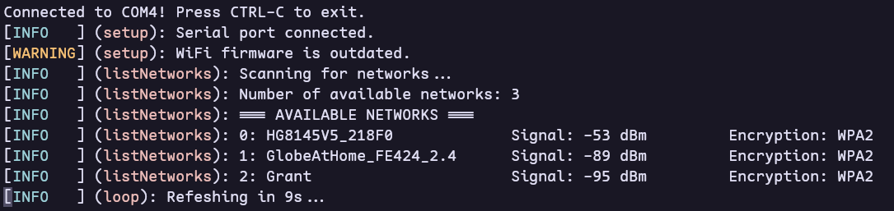

# Arduino WiFi Scanner

Simple Arduino Uno Wifi Rev 2 scanner with formatted printing.



> [!NOTE]
> This was made for the [Arduino CLI](https://arduino.github.io/arduino-cli/latest/) to be run in a terminal which supports ANSI escape codes. As a result, Arduino IDE's serial monitor displays extra characters.

## Requirements

- [Arduino CLI](https://arduino.github.io/arduino-cli/latest/)
- megaAVR core
  - CLI users: `arduino-cli core update-index && arduino-cli core install arduino:megaavr`
- [WiFiNINA](https://www.arduino.cc/reference/en/libraries/wifinina/)
  - CLI users: `arduino-cli lib install WiFiNINA`
- GNU Make (optional)

## Usage (Arduino CLI)

Clone this repository as `scanner`:

```pwsh
git clone https://github.com/cgvillarroel/arduino-wifi-scanner scanner
```

Install the PrettyLogger library (see `/plogger/README.md`).

Plug your board then identify your port and fully qualified board name (FQBN):

```pwsh
arduino-cli board list
```

Create a `sketch.yaml` with the details from above. For example:

```pwsh
arduino-cli board attach -p COM4 -b arduino:megaavr
```

> [!NOTE]
> For `make` users, replace the port variable in the `Makefile` with your port.

Compile, flash, and monitor:

```pwsh
arduino-cli compile && arduino-cli upload
arduino-cli monitor -p COM4
```

> [!NOTE]
> For `make` users, simply run `make m`

